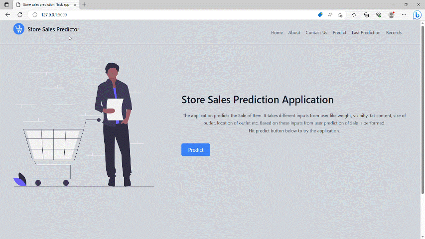
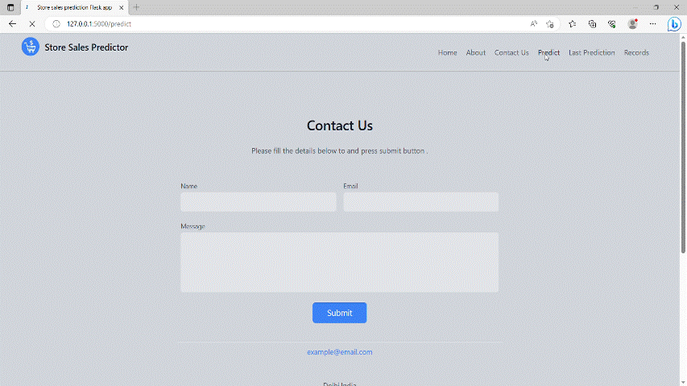

# Machine Learning Project
## Stores Sales Prediction
### Dataset : &nbsp; <a href="https://www.kaggle.com/datasets/brijbhushannanda1979/bigmart-sales-data/"></a>

## Libraries / Languages
  <a href="https://www.python.org"></a>
  <a href="https://pandas.pydata.org/"></a>
  <a href="https://numpy.org/"></a>
  <a href="https://scikit-learn.org/stable/"></a>
  <a href="https://flask.palletsprojects.com/en/2.2.x/"></a>
<a href="https://flask-sqlalchemy.palletsprojects.com/en/3.0.x/"></a>
<a href="https://www.evidentlyai.com/"></a>
<a href="https://mlflow.org/">  </a>

## Problem Statement
Nowadays, shopping malls and Big Marts keep track of individual item sales data in order to forecast future client demand and adjust inventory management. In a data warehouse, these data stores hold a significant amount of consumer information and particular item details. By mining the data store from the data warehouse, more anomalies and common patterns can be discovered.

## Approach
Build a 3 step pipeline.
- #### Step 1: Ingest Validate Clean Transform ####
  - 1.1: Data is first ingested from kaggle url using api.
  - 1.2: Then validated with schema file.
  - 1.3: Both test and trained data is cleaned using column transformer. Also cleaned trained data is further splitted into train and validation data in ratio of 80:20.
  - 1.4: Another column tranformer consisting of onehotencoder,standardscaler and robust scaleer is created. It is applied on train and validation set.

- #### Step 2: Training ####
 Varoius esperiments are performed on machine learning models . Various parameters and metrics alongwith registered models are stored in mlflow remote server.
  </br>
- #### Step 3:: Evaluation Pusher ####
  - 3.1: Various registered model are evaluated. Based on evaluation each model is send to production,staging or none stage on mlflow server.
  - 3.2: The model send to production stage is downloaded. Model is tested on test data. Upon clearing tests the model alognwith column transformer is send to application folder.

## Results
Build a flask based application solution that is able to predict the sales of the different stores of Big Mart according to the provided dataset.

## Flask Application Demo
<b>Home, About and Contact Page</b>

</br>
<b>Predict and Last Prediction Page</b>

</br>
<b>Record Page</b>


## Artifacts Tree
```
├───data_cleaning
│   └───clean_data
│           test.csv
│           train.csv
│           validation.csv
│
├───data_ingestion
│       Test.csv
│       Train.csv
│
├───data_transformation
│   │   column_transformer.pkl
│   │
│   └───transformed_data
│           train.npy
│           validation.npy
│
├───data_validation
│       report.html
│       report.json
│
├───model_evaluation
│   │   model_evaluation.csv
│   │
│   └───model
│           conda.yaml
│           MLmodel
│           model.pkl
│           python_env.yaml
│           requirements.txt
│
└───model_training
        mlflowruns.csv
```

## 💻 Setup
Create new environment &emsp;```conda create -n env python=3.8```
</br>Activating environment &emsp; &nbsp;```conda activate env```
</br>Deactivating environment  &ensp;```conda deactivate```
</br>Installing Requirements &emsp; &nbsp;```pip install requirements.txt```
</br>Running app to local server  ```python app.py```
### Software and Account Requirement
1. [Github Account](https://github.com/)
2. [Heroku Account](https://id.heroku.com/login)
3. [VS Code IDE](https://code.visualstudio.com/Download)
4. [Gitcli](https://git-scm.com/downloads)